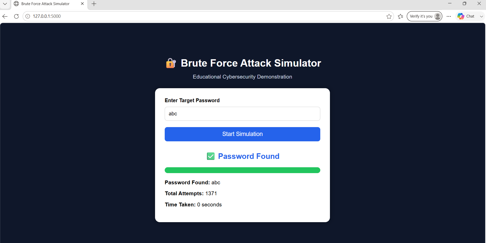

# 🔐 Brute Force Attack Simulator

## Overview

This project is an educational Brute Force Attack Simulator built using Python, Flask, HTML, CSS, and JavaScript. It demonstrates how a brute force attack works by trying different password combinations until the correct password is found in a safe, local environment.

## Dashboard Screenshot



## Features

- Simulates a brute force attack
- Displays the discovered password
- Shows total attempts required
- Measures execution time
- Modern and responsive web interface
- Educational cybersecurity demonstration

## Technologies Used

- Python
- Flask
- HTML
- CSS
- JavaScript

## Project Structure

```text
Brute_Force_Simulator/
│
├── app.py
├── brute_force.py
├── templates/
│   └── index.html
├── static/
│   ├── style.css
│   ├── script.js
│   └── images/
└── README.md
```

## How to Run

Clone the repository:

```bash
git clone https://github.com/Dhadi-Sahasra/Brute-Force-Simulator.git
```

Install Flask:

```bash
pip install flask
```

Run the application:

```bash
python app.py
```

Open:

```text
http://127.0.0.1:5000
```

## Disclaimer

This project is intended for educational purposes only. It demonstrates the concept of a brute-force attack in a controlled environment and is not designed to target or attack real systems.
